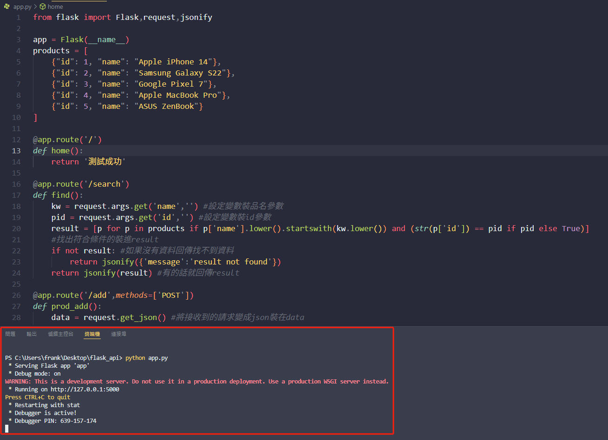
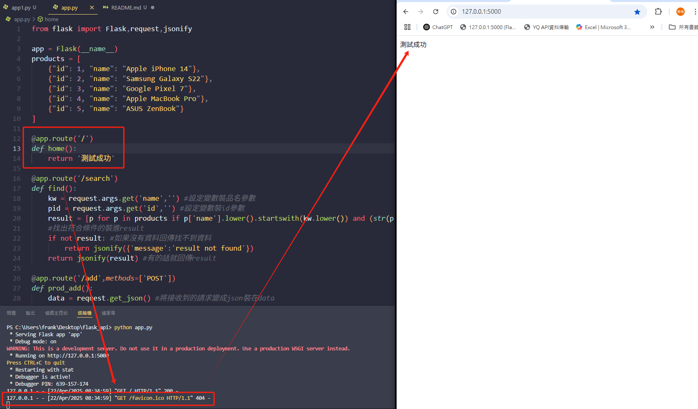
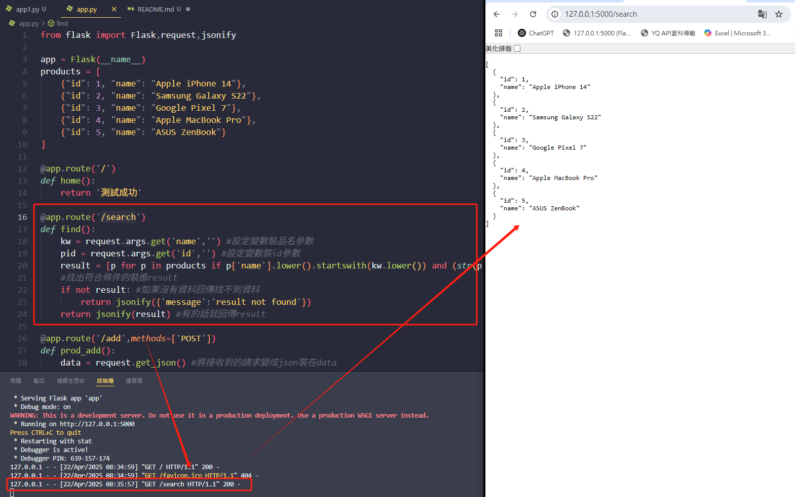
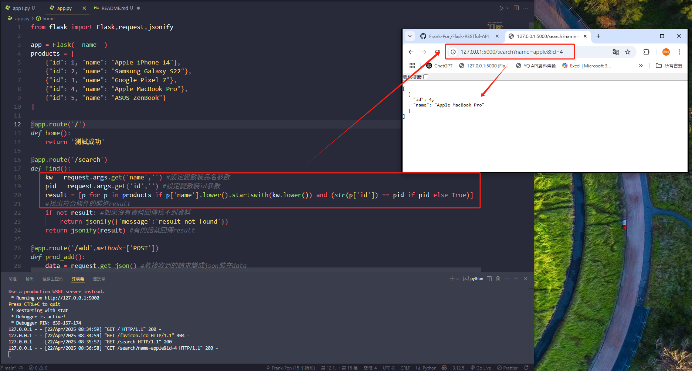
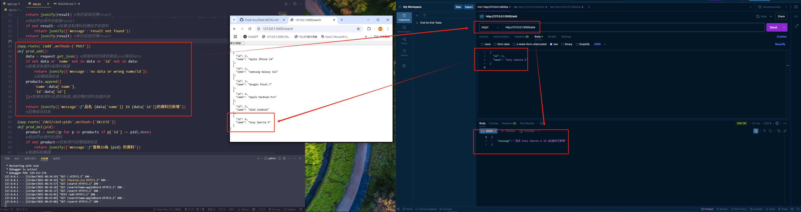
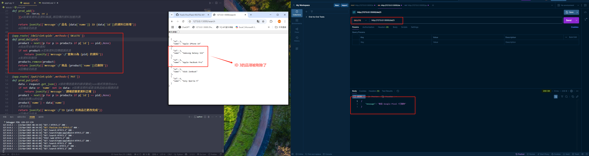
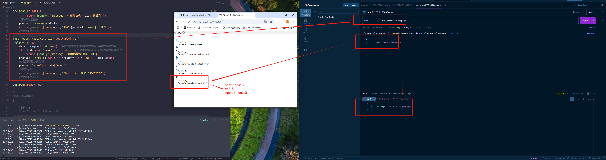

⭐Flask RESTful API練習

簡介:

這是一支Flask練習程式,實作了RESTful API的CRUD四大功能

其中包含:

Create - 新增 ( POST ) - http://127.0.0.1:5000/add

Read - 查詢 ( GET ) - http://127.0.0.1:5000/search(?name=xxx&id=xxx) - 加上參數可以精準查詢

Update - 修改 ( PUT ) - http://127.0.0.1:5000/put/(id) - 選擇要修改哪一個ID

Delete - 刪除 ( DELETE ) - http://127.0.0.1:5000/del/(id) - 選擇要刪除哪一個ID

功能使用說明:

只要在連結加上對應的參數就能夠顯示對應的資料,另外POST、PUT及DELETE需要透過POST MAN之類的API測試工具進行操作

✔️python 3.12 ✔️Flask ✔️Requests ✔️jsonify

專案結構:
```
interview_project
        ├─ app.py (主程式)
        ├─ README.md (程式簡介)
        └─screenshot (畫面截圖 for README)
```
使用方法:

( Git Clone用網址 https://github.com/Frank-Pon/Flask-RESTful-API.git ) clone之後 -> 安裝所需套件 ( Flask、Requests ) -> 在終端機輸入 python app.py -> 打開網頁輸入 127.0.0.1:5000 -> 開始使用 ✅

專案學習心得:

這是第三次使用Flask來做Side Project,但卻是第一次深入了解RESTful API及CRUD的架構與用途

以往只是透過AI的程式碼抄寫及使用,並不知道實際上的邏輯是如何運作

但透過這次從0開始拆解需求及思考撰寫才發現

RESTful的概念及語法其實不難,作為後端與前端的來往工具是非常好理解的

這也讓我在前後端的連結上更深入了一步









